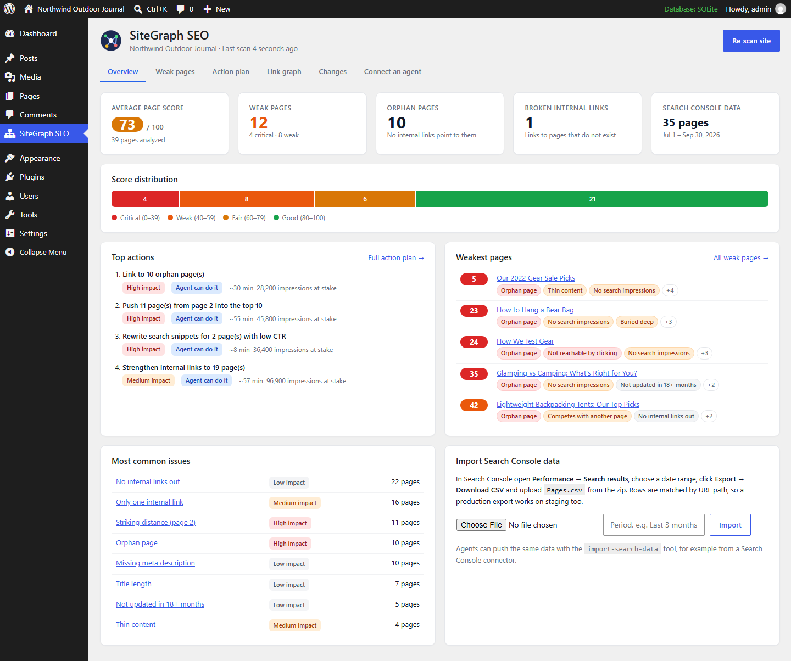
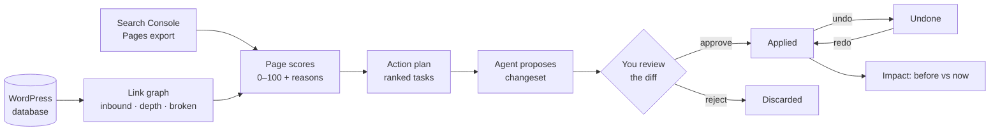
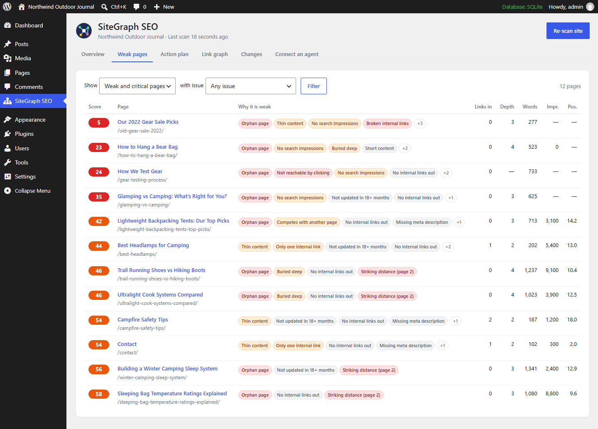
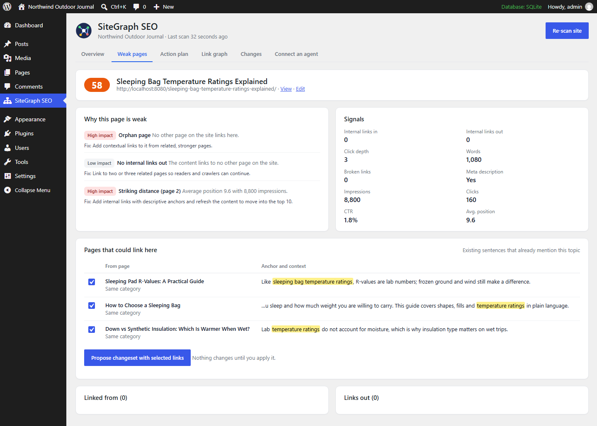
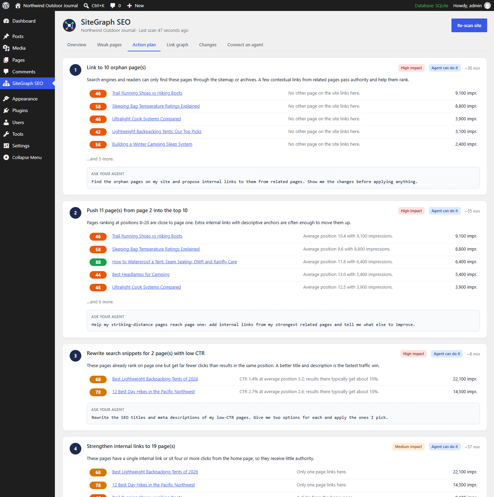
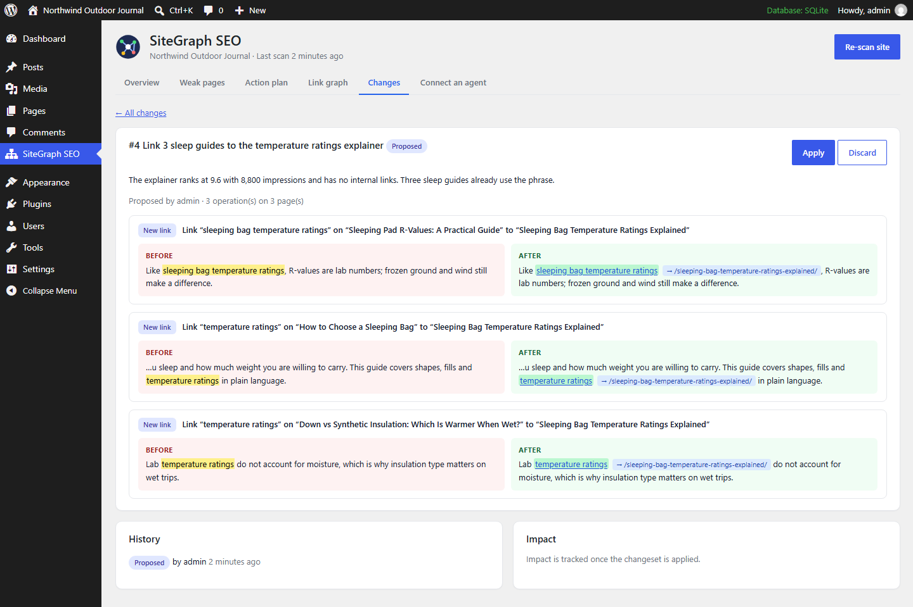
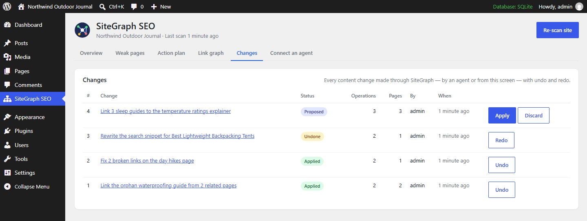
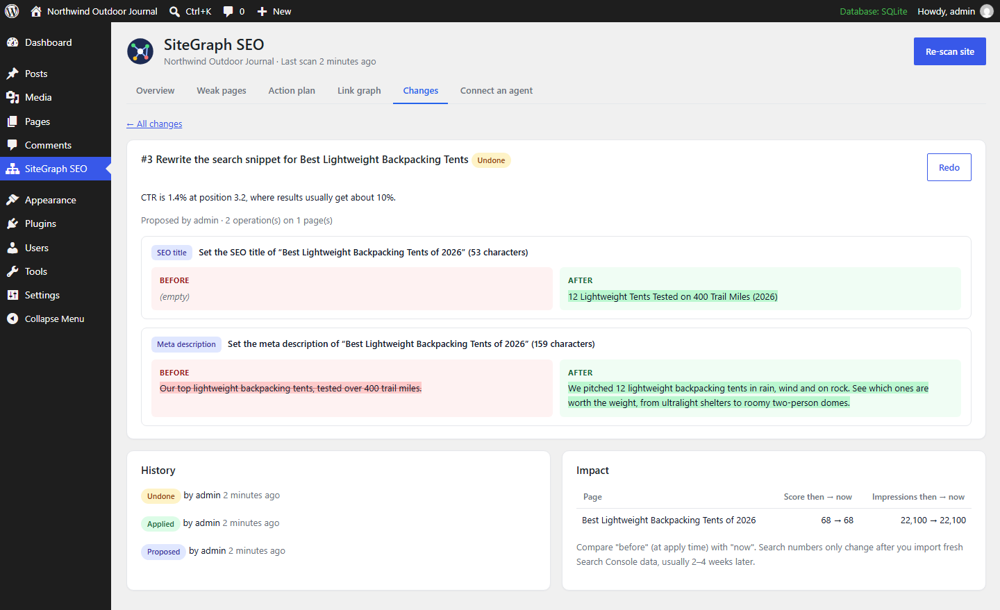
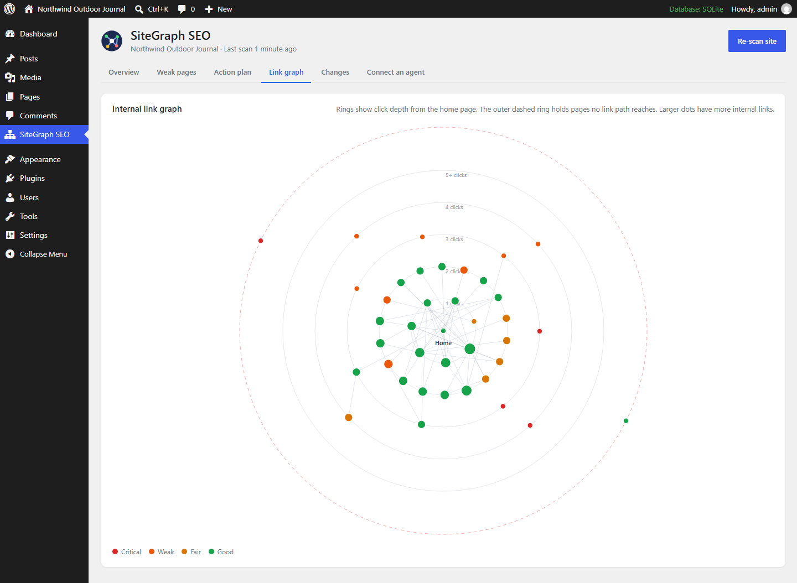
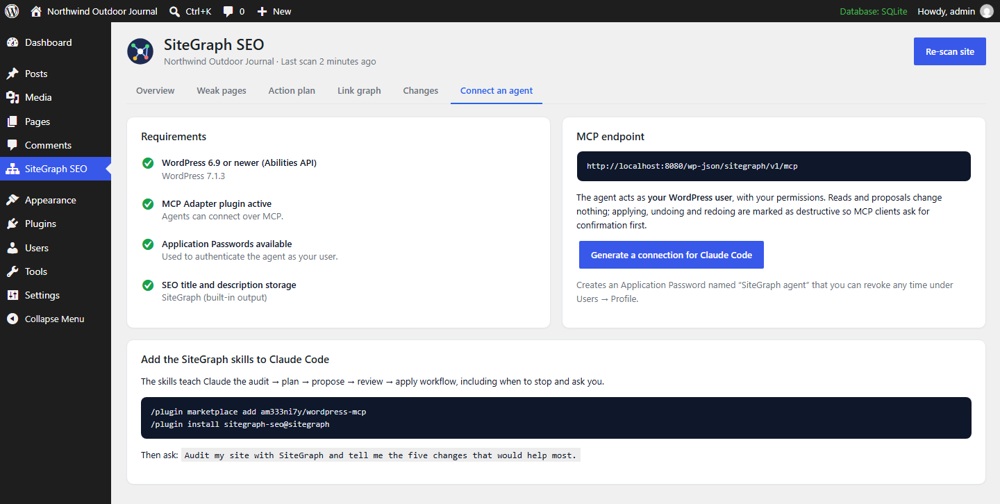

# SiteGraph SEO Agent

**Find the pages that are holding your WordPress site back, get a prioritized plan to fix them, and let Claude do the fixing — with a diff you approve and one-click undo.**

[](https://github.com/am333ni7y/wordpress-mcp/actions/workflows/ci.yml)


[](LICENSE)



SiteGraph is a WordPress plugin plus a set of Claude skills. The plugin reads your content straight from the database, maps every internal link, merges in your Google Search Console data, and scores every page from 0 to 100 with the reasons it is weak. It then exposes all of that — and a safe way to change things — to AI agents over MCP.

---

## Why this exists

The official WordPress MCP Adapter, the WordPress.com connector and the general-purpose MCP plugins give an agent **access**: read a post, update a post. That is plumbing. On its own it does not tell the agent *which* of your 400 pages deserve attention, *why*, or *what change would help* — and a raw "update post" tool is a risky thing to hand to an agent on a live site.

SiteGraph sits on top of that plumbing (it is built on the core Abilities API and the official MCP Adapter) and adds the two missing pieces:

1. **Judgment** — a site-wide link graph and page scores, joined with search demand, turned into a ranked action plan.
2. **Safety** — agents can only *propose* changesets. You see a before/after diff, approve it, and can undo or redo it at any time. Undo refuses to overwrite edits made after the change.

### What it replaces

| You do this today with… | SiteGraph… |
|---|---|
| A crawler (e.g. Screaming Frog) to find orphan pages, click depth and broken internal links | Reads the graph from the database in seconds, no crawl, always current |
| Spreadsheets joining a crawl with a Search Console export | Joins them for you and ranks pages by issues × demand |
| An internal-linking plugin's keyword suggestions | Finds sentences that *already* mention the topic and turns them into ready operations |
| Editing posts one by one in wp-admin | Applies a reviewed changeset in one step — and undoes it in one step |
| "What did the AI change last Tuesday?" | Every change has a history, a diff, and Undo/Redo buttons |

It does **not** replace keyword research or backlink tools (Ahrefs, Semrush): it works on what you control on your own site.

### Questions it answers that other tools can't

Because it sees your internal links, your content, your search data *and* can act, an agent with SiteGraph can answer things like:

- *"Which pages get search impressions but have zero internal links pointing to them?"*
- *"I have an hour this week. Which five changes would help the most?"*
- *"Which existing sentences on my site could link to this page, and with what anchor?"*
- *"Which pages rank on page one but get far fewer clicks than they should?"*
- *"Which two pages are competing for the same topic?"*
- *"Undo the links you added yesterday, but keep the meta descriptions."*
- *"Did the links we added last month move those pages?"*

---

## How it works



1. **Scan** (`scan-site`) — parses every published page's content, resolves each internal link to a post, and computes inbound links, outbound links, broken links and click depth from the home page (following content links, menus and paginated category archives). Nothing is crawled and nothing is changed.
2. **Search data** (`import-search-data`) — upload the Search Console *Pages* CSV in wp-admin, or let the agent push rows from a Search Console connector. Rows are matched by URL path, so a production export works on staging.
3. **Score** — each page starts at 100 and loses points per issue (see [Scoring](#scoring)).
4. **Plan** (`get-action-plan`) — groups pages into tasks, ranked by impact, search demand at stake and effort. Each task says whether an agent can do it, what tools to use, and a prompt you can give the agent.
5. **Change** — the agent proposes a changeset; you approve; it is applied atomically, recorded, and reversible.

---

## A typical session with Claude

On the demo site in this repository (39 pages, three months of Search Console data):

> **You:** Audit my site with SiteGraph and tell me what to fix first.
>
> **Claude:** I scanned 39 pages. Average score is 73; 12 pages are weak or critical, 10 are orphans (no internal links), and 1 internal link is broken.
> The three changes that matter most:
> 1. **Link to 10 orphan pages** — they have 28,200 impressions between them but no page links to them. Top ones: *Trail Running Shoes vs Hiking Boots* (9,100 impressions), *Sleeping Bag Temperature Ratings Explained* (8,800). I can do this.
> 2. **Push 11 pages from page 2 into the top 10** — e.g. *How to Waterproof a Tent* at position 11.8 with 6,400 impressions. Internal links from your strongest tent pages should help.
> 3. **Rewrite two search snippets** — *Best Lightweight Backpacking Tents of 2026* ranks at 3.2 but gets 1.4% CTR, where results usually get ~10%.
>
> Want me to propose the internal links for the orphan pages? I'll show you every change before anything is applied.
>
> **You:** Yes, start with the temperature ratings page.
>
> **Claude:** Changeset #4 links it from three sleep guides that already use the phrase — for example on *Sleeping Pad R-Values*: "Like **sleeping bag temperature ratings**, R-values are lab numbers…". Nothing has changed yet. Apply it?
>
> **You:** Apply.
>
> **Claude:** Applied. The page now has 3 internal links and is no longer an orphan. Say "undo changeset #4" or click Undo in wp-admin to revert it exactly.

The conversation above is illustrative; the numbers are the real output of the tools on the demo site.

---

## Screens

### Weak pages — weakest first, with the reasons



### Page report — why a page is weak, and which pages could link to it

The suggestions are existing sentences on related pages. Select them and propose a changeset without leaving wp-admin.



### Action plan — what to do, why, how long it takes, and whether an agent can do it



### Review before anything changes



### Undo and redo, with history and impact





### Link graph

Rings show click depth from the home page; colors show page scores; pages outside the dashed ring cannot be reached by clicking.



---

## Quick start

### Requirements

- WordPress **6.9 or newer** (for the Abilities API) and PHP 7.4+
- The **[MCP Adapter](https://wordpress.org/plugins/mcp-adapter/)** plugin, so agents can connect
- HTTPS on live sites (Application Passwords require it)

### 1. Install the plugin

Copy the [`sitegraph-seo-agent`](sitegraph-seo-agent) folder to `wp-content/plugins/` (or zip it and upload it under **Plugins → Add New → Upload**), then activate it. Open **SiteGraph SEO** in wp-admin and click **Scan site**.

### 2. Add Search Console data (recommended)

Search Console → **Performance → Search results** → pick a date range → **Export → Download CSV**. Upload `Pages.csv` from the zip on the SiteGraph Overview screen.

### 3. Connect Claude Code

Open **SiteGraph SEO → Connect an agent** and click **Generate a connection for Claude Code**. It creates a revocable Application Password and shows a ready command once:

```bash
claude mcp add --transport http sitegraph https://your-site.com/wp-json/sitegraph/v1/mcp --header "Authorization: Basic <generated>"
```



### 4. Install the SiteGraph skills

The skills teach Claude the workflow: audit → plan → propose → review → apply, and when to stop and ask you. In Claude Code:

```text
/plugin marketplace add am333ni7y/wordpress-mcp
/plugin install sitegraph-seo@sitegraph
```

Then ask: *"Audit my site with SiteGraph and tell me the five changes that would help most."*

| Skill | Use it for |
|---|---|
| `seo-audit` | Health check and a short prioritized plan with evidence |
| `fix-internal-links` | Orphans, deep pages, striking-distance pages — proposes links, applies after approval |
| `rewrite-snippets` | Low-CTR pages and missing descriptions — offers options, applies the chosen ones |
| `review-changes` | "What did you change?", undo, redo, and measuring impact |

Other MCP clients (Cursor, VS Code, Claude Desktop through a proxy) can use the same endpoint; the [MCP Adapter docs](https://github.com/WordPress/mcp-adapter) cover client configuration.

---

## MCP tools

All tools are WordPress abilities in the `sitegraph/` namespace, exposed on a dedicated MCP server at `/wp-json/sitegraph/v1/mcp` (tool names use `-`, e.g. `sitegraph-scan-site`). They are also discoverable through the MCP Adapter's default server.

| Tool | Changes content? | What it does |
|---|---|---|
| `scan-site` | No | Builds the link graph and scores pages; resumable for large sites |
| `get-site-overview` | No | Health summary, issue counts, five weakest pages |
| `list-weak-pages` | No | Pages weakest first, filterable by issue and post type |
| `get-page-report` | No | One page: issues and fixes, inbound/outbound/broken links, search data, SEO fields |
| `get-action-plan` | No | Ranked tasks with impact, effort, automation level and a suggested prompt |
| `suggest-internal-links` | No | Existing sentences that could link to a page, as ready operations |
| `import-search-data` | No (stores search data) | Page-level Search Console rows |
| `propose-changeset` | No | Validates operations against live content and stores a reviewable proposal |
| `apply-changeset` | **Yes** (destructive hint) | Applies a proposal atomically; refuses if content changed since |
| `undo-changeset` | **Yes** (destructive hint) | Restores every field exactly; refuses to overwrite newer edits |
| `redo-changeset` | **Yes** (destructive hint) | Re-applies an undone changeset |
| `discard-changeset` | No | Drops a proposal |
| `list-changesets` / `get-changeset` | No | History, diffs, available actions, impact before vs now |

**Changeset operations:** `add_internal_link` (wrap an existing phrase in a link — never inside headings or existing links), `replace_text`, `set_post_title`, `set_seo_title`, `set_meta_description`. SEO fields are written to Yoast SEO, Rank Math or SEOPress when active; otherwise SiteGraph prints the title tag and meta description itself.

---

## Scoring

Every page starts at 100. Issues subtract points; the most damaging are listed first.

| Issue | Points | Impact | Needs Search Console |
|---|---:|---|:---:|
| Orphan page (no internal links in) | −30 | High | |
| Not reachable by clicking from home | −15 | High | |
| Broken internal links | −10 | High | |
| Low CTR for its position (≥ 500 impressions) | −12 | High | ✓ |
| Striking distance (position 8–20) | −6 | High | ✓ |
| Thin content (< 300 words; pages < 150) | −20 | Medium | |
| No search impressions | −15 | Medium | ✓ |
| Buried deep (4+ clicks) | −12 | Medium | |
| Only one internal link in | −10 | Medium | |
| Competes with another page for the same topic | −10 | Medium | |
| Short content (< 600 words) | −8 | Low | |
| Not updated in 18+ months | −8 | Low | |
| No internal links out | −6 | Low | |
| Missing meta description | −6 | Low | |
| Title shorter than 20 or longer than 65 characters | −4 | Low | |

Scores of 0–39 are *critical*, 40–59 *weak*, 60–79 *fair*, 80–100 *good*. The score is a way to prioritize work on your site, not a Google metric. The home page, blog index and privacy policy are exempt from the link and length checks.

---

## Safety model

- **Real user, real permissions.** The agent authenticates as your WordPress user with an Application Password. Tools require `edit_others_posts` (Editors and Admins; filter `sitegraph_capability`), and every write also checks `edit_post` for each post.
- **Narrow writes.** Five operation types; writes are limited to post content, post title and the SEO title/description fields of supported SEO plugins. No raw SQL, no arbitrary meta, no deletes.
- **Propose → review → apply.** Proposals never change content. Apply, undo and redo carry MCP `destructiveHint`, so clients ask before running them.
- **Exact, conflict-safe undo.** Changesets store the exact before/after of every field. Undo and redo refuse when content changed in the meantime and name the newer changeset that touched it; `force` exists but the skills only use it after you explicitly agree.
- **History.** Who proposed, applied, undid and redid what, and when. WordPress revisions are still created as usual.

See [SECURITY.md](SECURITY.md).

---

## Try the demo locally

The `demo/` folder seeds an outdoor-gear blog ("Northwind Outdoor Journal", 32 posts and 7 pages) with realistic problems: orphans, thin pages, broken links, two cannibalizing tent lists, buried pages, and a Search Console export with low-CTR and striking-distance pages.

```bash
php demo/seed-demo-site.php /path/to/wordpress --yes-wipe   # local/dev sites only; replaces posts and pages
php demo/demo-changesets.php /path/to/wordpress             # scan, import search data, create sample changesets
php tests/run-integration.php /path/to/wordpress            # 68 end-to-end checks through the Abilities API
```

CI runs the same suite on every push against the latest WordPress with SQLite and the MCP Adapter. See [CONTRIBUTING.md](CONTRIBUTING.md) for a full local setup.

---

## Limitations (v0.1)

- **Search Console data is imported**, not fetched: upload the CSV or let an agent push rows from a Search Console connector. A direct Google connection is on the roadmap.
- **Click depth is modeled**, not crawled: content links, menus (classic and block navigation), the blog index and category archives are followed; links printed only by theme templates or widgets are not.
- **Cannibalization uses titles and focus keywords**, not query-level data.
- **Claude Code first.** claude.ai custom connectors need OAuth, which WordPress Application Passwords don't provide; OAuth support is on the roadmap.
- Tested end-to-end on the demo site; performance on very large sites (10,000+ posts) has not been benchmarked yet. Scans are resumable and run in time-boxed batches.

## Roadmap

- OAuth so SiteGraph works as a claude.ai / Claude Desktop connector
- Direct Search Console connection with scheduled re-imports and automatic impact reports
- Query-level cannibalization, redirects and "merge pages" changesets
- WP-CLI commands and background scans for large sites
- WooCommerce product and category pages

## Repository layout

```
sitegraph-seo-agent/   WordPress plugin (abilities, MCP server, admin screens)
claude-plugin/         Claude Code plugin: SiteGraph skills
.claude-plugin/        Marketplace manifest (/plugin marketplace add am333ni7y/wordpress-mcp)
demo/                  Demo site seed, Search Console sample, sample changesets
tests/                 Integration suite, test installer, php -S router
docs/screenshots/      Images used in this README
```

The earlier Node.js `wordpress-mcp` server (generic post CRUD over WP-CLI/REST) is preserved in the git history before this release.

## License

[MIT](LICENSE) © Amin Zahed
